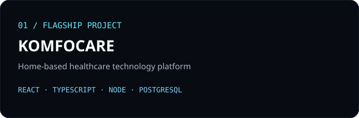
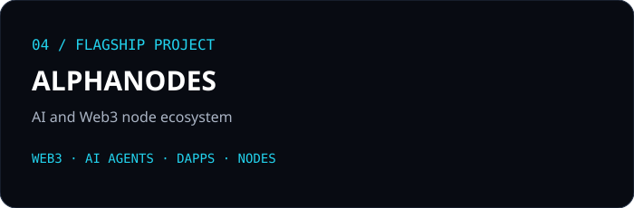
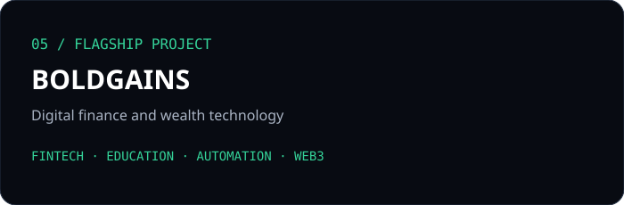
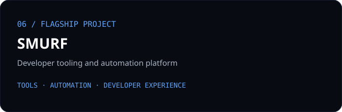
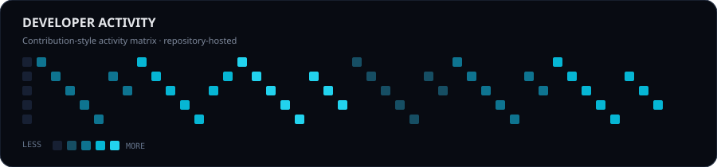

<div align="center">

# SETHDEV254

### AI ENGINEER · WEB3 DEVELOPER · SOFTWARE ENGINEER

**Building intelligent products, decentralized systems & modern digital experiences.**

[](https://github.com/SethDEV254)
[](https://github.com/SethDEV254)

</div>

<div align="center">

</div>

## `~/about`

I build at the intersection of **Artificial Intelligence, Web3 and Software Engineering** — turning ambitious ideas into useful, scalable products.

My work spans AI-powered applications, intelligent agents, blockchain systems, decentralized applications, APIs and full-stack platforms.

```text
AI            → Agents · Machine Learning · Automation
WEB3          → Blockchain · Smart Contracts · dApps
ENGINEERING   → Full-Stack · APIs · Architecture · Cloud
```

## `~/expertise`

<div align="center">

| 🤖 AI | ⛓️ WEB3 | ⚡ ENGINEERING |
|:---:|:---:|:---:|
| AI Agents | Blockchain | Full-Stack |
| ML / Automation | Smart Contracts | APIs & Backend |
| Intelligent Systems | dApps | Architecture |

</div>

## `~/tech-stack`

<div align="center">


</div>

## `~/flagship-projects`

<div align="center">

<a href="https://github.com/SethDEV254/Komfocare"></a>
<a href="https://github.com/SethDEV254/BullBear-Trading.co"></a>

<a href="https://github.com/SethDEV254/Aura-crypto-and-Fx-Ai"></a>
<a href="https://github.com/SethDEV254/Alphanodes"></a>

<a href="https://github.com/SethDEV254/BOLDGAINS"></a>
<a href="https://github.com/SethDEV254/smurf-tool"></a>

</div>

## `~/what-i-build`

**AI & Automation** — intelligent applications, agents and practical automation.

**Web3 & FinTech** — blockchain products, decentralized systems and trading technology.

**Full-Stack Platforms** — production-minded frontend, backend, APIs and data systems.

**Developer Tools** — utilities and experiments designed to make engineering workflows better.

## `~/current-focus`

- 🤖 AI agents, intelligent automation & applied ML
- ⛓️ Web3 infrastructure & decentralized applications
- ⚡ Scalable APIs and full-stack systems
- 🧰 Developer tools and engineering workflows
- 🌍 Open-source projects and practical experimentation

## `~/github-analytics`

<div align="center">


<br/>



</div>

```text
ACTIVITY PIPELINE

GitHub activity
      ↓
GitHub Actions
      ↓
Local SVG assets
      ↓
README profile

NO FRAGILE STATS CARDS
```

## `~/engineering-philosophy`

> **Build boldly. Ship clean. Learn continuously.**

Great engineering is not only about writing code. It is about understanding the problem, designing deliberately, making strong technical decisions and creating systems that can evolve.

<div align="center">

### `LET'S BUILD THE FUTURE.`

[GitHub](https://github.com/SethDEV254) · [Repositories](https://github.com/SethDEV254?tab=repositories)

</div>
